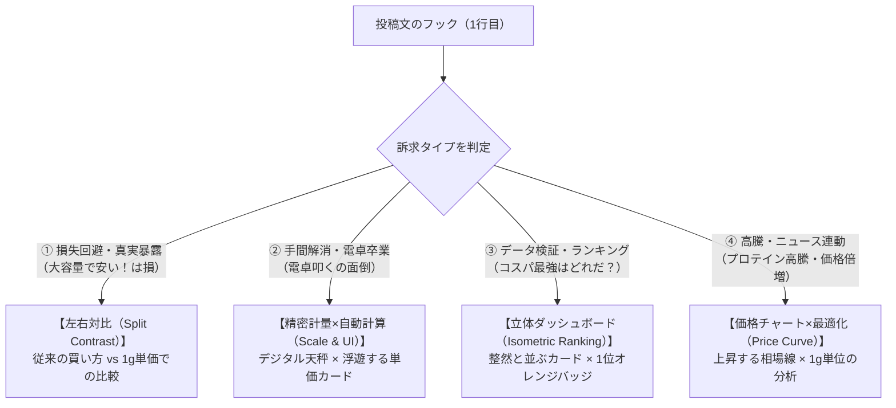

Searched web: "X 投稿 画像 組み合わせ バズる アイキャッチ 構成 比率 プロンプト Imagen3"
Searched web: "SaaS Web service launch viral visual twitter X prompt"

リサーチした**Xでバズる「投稿文 × アイキャッチ画像」の連動ロジック**を体系化し、**「投稿内容（Post本文）からImageFXプロンプトを即座に導き出すフレームワーク」**としてまとめました。

---

# 1. バズる「投稿文 × アイキャッチ」の連動メソッド（リサーチ結果）

Xのタイムラインにおいて、画像は単なる飾りではなく**「投稿文の冒頭1行目（フック）を0.5秒で脳に直感理解させる装置」**です。

投稿文の訴求タイプによって、効果的な画像の構図（Visual Archetype）は以下の**4パターン**に分類されます。



---

# 2. Pergram専用 ImageFXプロンプトの「黄金生成式」

PergramのLPデザイン（CSSトークン）と完全に一致させるため、以下の固定パーツを組み合わせてプロンプトを生成します。

### 🎨 カラー＆世界観トークン（共通固定パーツ）
* **背景**: `warm paper white (#FAFAF9)` または `deep navy slate (#0F172A)`
* **主色**: `deep ink (#0F172A)`
* **アクセント**: `impulse orange (#EA580C)`
* **トーン**: `Swiss graphic design, technical minimalism, clean isometric 3D UI, scientific precision, studio lighting`

---

# 3. 投稿内容別：プロンプト生成実例（4パターン）

投稿文の内容が決まったら、該当するプロンプトをそのままImageFXにコピペして生成してください。

---

### パターンA：【損失回避・真実暴露ポスト】
#### 📝 投稿文例
> 「3kgで安い！」と買っても、タンパク質含有率が低くて実は損しているかも…。パッケージ価格ではなく「タンパク質1gあたりの実質価格」でプロテインを自動並べ替えするWebサービス【Pergram】を公開しました！

#### 🖼 ImageFXプロンプト（左右対比・Split View）
```text
A 16:9 minimalist split comparison visual for a protein cost analysis service named pergram. Swiss graphic design style, warm off-white (#FAFAF9) background with deep navy-slate (#0F172A) structure and vibrant impulse orange (#EA580C) accents. Left side shows an opaque, bulky generic protein bag with a faint faded label. Right side shows a sleek transparent canister on a high-precision digital gram scale, with a glowing floating UI card displaying "¥/g Unit Price" highlighted in orange. Clean composition, sharp focus, modern tech aesthetic, studio lighting, hyper-realistic, 8k, no clutter.
```

---

### パターンB：【手間解消・電卓卒業ポスト】
#### 📝 投稿文例
> プロテインのセールや買い替えのたびに、電卓を叩いて「タンパク質1gあたり何円…？」って計算する手間をゼロに。主要プロテインの成分単価と真の最安値を一発で可視化するWebサービス【Pergram】です🏋️‍♂️

#### 🖼 ImageFXプロンプト（精密計量 × 自動計算UI）
```text
A 16:9 modern tech visual representing automated protein cost calculation. Clean aesthetic on a matte light slate-white (#FAFAF9) background. In the center, a futuristic minimalist digital micro-scale measuring pure protein powder, connected by sleek orange (#EA580C) optical metric lines to floating 3D calculation cards and clean number counters. Deep ink (#0F172A) typographic grid lines, soft ambient shadows, premium editorial magazine lighting, 8k resolution, crisp detail.
```

---

### パターンC：【検証・ランキングポスト】
#### 📝 投稿文例
> 【検証】プロテイン高騰の今、「タンパク質1gあたり最安」のコスパ最強プロテインはどれなのか？主要メーカーの成分表から実質価格を全計算・比較できるWebサービス【Pergram】を公開しました📊

#### 🖼 ImageFXプロンプト（立体ランキングボード）
```text
A 16:9 isometric 3D data ranking dashboard for protein supplement costs. Clean minimalist Swiss layout with warm paper white (#FAFAF9) canvas, dark slate (#0F172A) UI panels, and bright impulse orange (#EA580C) highlights. Vertically stacked floating UI rows comparing protein products by price-per-gram. The top #1 ranked item glows with an orange pill badge reading "Best Value". Sleek bar charts, clean geometric data aesthetics, diffused studio lighting, ultra-sharp focus.
```

---

### パターンD：【価格高騰・ニュース連動ポスト】
#### 📝 投稿文例
> プロテイン高騰 2年で価格倍増…。値上げの今こそ、袋の価格ではなく「タンパク質1gあたりの実質単価」で選ぶのが大事です。主要プロテインの1g単価を一瞬で比較できる無料サービス【Pergram】📊

#### 🖼 ImageFXプロンプト（価格チャート × 最適化）
```text
A 16:9 editorial visual illustrating rising protein prices and smart cost optimization. Matte neutral light background (#FAFAF9) with subtle deep navy (#0F172A) data graphs showing market inflation curves. In the foreground, an elegant minimalist protein scoop and a glowing orange (#EA580C) data pill tag highlighting "1g Real Cost", cutting through the inflation curve. Clean, intelligent, financial-data meets fitness aesthetic, hyper-detailed, studio shot.
```

---

# 4. 今後の運用フロー（投稿文が決まったら）

新しい投稿文を作成した際は、以下のステップでプロンプトを組むだけで、投稿内容に完全連動したアイキャッチが作れます。

1. **投稿文のフック（1行目）を確認する**
2. **4つの型（対比 / 計量・計算 / ランキング / 価格チャート）から1つ選ぶ**
3. **ImageFXにプロンプトを貼り付けて「16:9」で生成する**


# 5. Gemini用プロンプト
あなたは世界最高峰のWebエディトリアルデザイナーです。
以下の【Xの投稿文】を読み取り、投稿内容に最も適した構図（4つのバリエーションから自動選択）で、Xタイムラインで0.5秒で指を止める「クリーンで知的な16:9のアイキャッチ画像」を生成してください。

### 【厳守】AI slopの完全排除 ＆ Pergramライトテーマ
- ❌ ネオン、サイバーパンク、暗い背景、テカテカした3Dホログラムは【完全禁止】。
- ⭕ マットなオフホワイト紙地（#FAFAF9）をベースに、清潔感のある白カード（#FFFFFF）、ディープインク（#0F172A）の文字、要所のみインパルス・オレンジ（#EA580C）を使った洗練されたエディトリアルデザイン。

---

### 【重要】投稿内容に応じた「4つの構図パターン」（Geminiが最適な1つを自動選択）

■ パターン1：【ランキング比較型】（「コスパ最強はどれだ」「主要メーカー検証」などの投稿時）
- 構図: 上部に太字の日本語キャッチコピー。下部に実際のPergram「ランキングリストUI」を配置。
  - 1位の行: 背景が薄いペールオレンジ（#FFF7ED）、オレンジの丸バッジ「1」、商品画像、商品名（ザバス等）、右端に太字オレンジの「¥9.9/g（袋 ¥5,656）」。
  - 2位・3位の行: 白背景、グレー丸バッジ「2」「3」、商品画像、右端に「¥11/g」「¥12/g」。

■ パターン2：【1商品フォーカス・真実暴露型】（「3kgで安いは損」「大容量の落とし穴」などの投稿時）
- 構図: 左側に「大容量で安い！は実は損？」「含有率で割ると真実が見える」の特大文字。右側にPergramの「商品カードUI（商品画像、中央に『タンパク質1gあたり ¥9.9/g』のハイライト枠、含有率71%、ダークネイビーの最安ボタン）」をドンと配置。

■ パターン3：【二分割対比型（Before / After）】（「電卓叩くの面倒」「セール時の悩み」などの投稿時）
- 構図: 左右（または上下）で対比。
  - 左（従来の損）: 薄いグレー背景に「❌ パッケージ価格だけで選ぶ（電卓計算、含有率が低くて損）」
  - 右（Pergramの解決）: 白背景＋オレンジ枠に「⭕ タンパク質1gあたりの価格で選ぶ」＋Pergramの「¥9.9/g」カードUI。

■ パターン4：【知らなきゃ損する3大Tips型】（「プロテイン高騰時代の選び方」「失敗しない買い方」などの投稿時）
- 構図: 雑誌の見開きのように、3つのステップカード（1. 袋の値段を見るな ➔ 2. 含有率を見ろ ➔ 3. 1g単価で比べろ）を横並びで整理し、右下にPergramのミニUIを添えたエディトリアル図解。

---
【Xの投稿文】:
「3kgで安い！」と買っても、タンパク質含有率が低くて実は損しているかも…。
パッケージ価格ではなく「タンパク質1gあたりの実質価格」だけでプロテインを自動並べ替えするWebサービス【Pergram】を公開しました！
登録不要・完全無料で使えます👇
