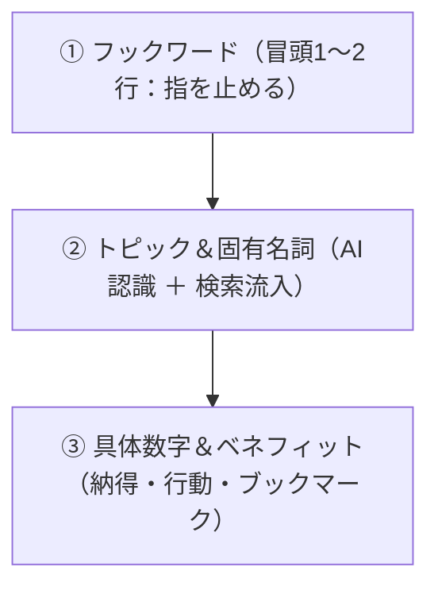

## Xポストのクエリコマンド
 * 例: (個人開発 OR Webサービス OR 作りました) min_faves:300 lang:ja

## 投稿文のメソッド
投稿文に含めるワードには、**「XのAIアルゴリズムにターゲット層を認識させる」**ことと、**「タイムラインをスクロールする人間の指を止める」**ことの2つの目的があります。

まずは**「ワード選定の基本メソッド」**を解説し、その上で今回の**「Pergram（プロテイン・サプリの成分単価・コスパ比較ツール）」に最適化された具体的なワードと投稿文例**を提案します。

---

### 1. 投稿文のワード選定「3層メソッド」

Xでバズる投稿文は、以下の3つの要素（層）を組み合わせて構成されています。



| 層 | 役割 | 使えるキーワードの種類 |
| :--- | :--- | :--- |
| **① フックワード**<br>（感情・損失回避） | タイムラインで「え？」と思わせて指を止める | 「実は損してる」「見た目に騙されるな」「面倒すぎたので」「電卓叩くのやめた」「結論」「これ知ってた？」 |
| **② トピック＆固有名詞**<br>（ターゲット共感・AI認識） | XのAIにジャンルを特定させ、興味層のおすすめに出す | **「プロテイン」「タンパク質1gあたり」「WPI/WPC」「マイプロ」「エクスプロージョン」「SAVAS」「セール」** |
| **③ 具体数字＆ベネフィット**<br>（説得力・保存） | ツールを使う明確なメリットを伝える | **「3秒で」「1gあたり〇円」「年間〇万円浮く」「登録不要」「完全無料」「全比較」** |

---

### 2. 今回のサービス（Pergram）に刺さるキーワード集

Pergramの最大の価値は**「パッケージの見た目の価格ではなく、成分1gあたりの真のコスパがわかること」**です。

### ターゲット（トレーニー、ダイエッター、コスパ重視派）に刺さるワード一覧

* **課題・共感ワード**:
  * `電卓叩いてた` / `セールで結局どれが安いかわからない` / `値上げラッシュ` / `プロテイン高すぎる` / `コスパ重視`
* **専門・比較ワード（AIに好まれるトピック語）**:
  * `タンパク質1gあたりの単価` / `実質価格` / `タンパク質含有率` / `WPCとWPI` / `セール時価格`
* **主要ブランド・固有名詞（検索・おすすめに乗りやすい）**:
  * `マイプロテイン` / `エクスプロージョン` / `VALX` / `SAVAS` / `ビーレジェンド` / `グロング`
* **アクション誘発ワード**:
  * `一瞬で比較` / `自動計算` / `ブックマーク推奨` / `登録不要・無料`

---

### 3. 切り口別の投稿文・実践テンプレート

### パターンA：【損失回避・真実暴露型】（最もクリック率・ブックマークが高い）
> **【ポイント】** 「間違った買い方で損しているかも」と不安を刺激し、ツールの必要性を提示する。

```text
「3kgで6,000円！安い！」って買ってる人、実は損してるかも…

プロテインは内容量じゃなくて「タンパク質1gあたりの単価」で比較しないと意味がないので、主要メーカーの真のコスパを一瞬で計算・比較できるWebサイト作りました。

エクスプロージョン、マイプロ、VALX等の含有率と単価を一覧化してます👇
```

---

### パターンB：【日常の面倒解消型】（共感・RTされやすい）
> **【ポイント】** トレーニーが誰もが一度はやったことのある「セール時の電卓計算」の面倒さに共感する。

```text
Amazonセールやマイプロのゾロ目セールのたびに「結局タンパク質1gあたりいくらだ…？」って電卓叩くの面倒すぎたので、成分あたりの実質価格を自動比較するツールを作りました。

・主要ブランドのタンパク質1g単価を自動算出
・WPC / WPI / フレーバー別の比較対応
・完全無料＆登録不要

筋トレ民はブクマしておくとセールの時に役立ちます👇
```

---

### パターンC：【議論・会話誘発型】（アルゴリズム評価が最も高い）
> **【ポイント】** 「1位はどれだと思う？」と問いかけることでリプライ欄を活性化させ、インプレッションをブーストさせる。

```text
【検証】いま一番「タンパク質1gあたりのコスパ最強」なプロテインはどれなのか、全主要メーカーの成分表から単価を全計算してみました。

1位はエクスプロージョンかと思ってたら、セール時の〇〇がまさかの1gあたり〇.〇円…。

皆さんは普段コスパ重視でどれ飲んでますか？（リプで教えてください👇）
```

---

### パターンD：【個人開発・Build in Public型】（エンジニア・開発者界隈からも拡散）
> **【ポイント】** 「自分が欲しかったから作った」という開発ストーリーで応援を誘う。

```text
筋トレ歴〇年の自分が「プロテイン選びで一番欲しかった比較ツール」を個人開発しました！

パッケージ価格ではなく「タンパク質1gあたりの実質価格」に換算して比較できるWebサイト「Pergram」を公開しました。

まだβ版なので、「このブランドも追加してほしい」「この機能欲しい」などあれば気軽にリプください！🙇‍♂️
```

---

### 4. 投稿時の注意点（NGパターン）

1. **1投稿目にURLを貼らない**
   * アルゴリズム対策として、URLは必ず**「ツリーの2投稿目（自分のリプライ欄）」**に貼る。
2. **ハッシュタグをつけすぎない（最大1〜2個まで）**
   * `#プロテイン #筋トレ #コスパ #ダイエット #個人開発` のように羅列するとスパム判定され表示が伸びません。ハッシュタグなし、または `#筋トレ` 1つ程度で十分です（本文中の単語でAIが勝手に判定してくれます）。
3. **画像のキャプチャ・デモ動画を必ず1枚目に添付する**
   * 実際の比較画面や「1gあたり〇円」と並んでいるUIのスクショ/動画があると、滞在時間が伸びてインプレッションが跳ね上がります。


---

## リプライ戦略
結論から言うと、**手当たり次第にリプライを送りまくる手法は絶対にNG（逆効果）**です。

Xのアルゴリズム上、知らないアカウントに宣伝リプライを連投すると**「スパム判定」「シャドウバン（誰のおすすめにも出なくなる）」「最悪はアカウント凍結」**のリスクが非常に高く、ユーザーからも嫌われてしまいます。

「プロテインの投稿にいいねしているような熱量の高いターゲット層」に、嫌われずに自然にリーチさせる**4つのスマートな手法**があります。

---

# 1. バズっているプロテイン投稿への「有益ぶら下がりリプ」
最も即効性があり、何千人ものターゲットに一度に見てもらえる手法です。

* **やり方**:
  「プロテイン買った」「Amazonセールでプロテイン安くなってる」といった、**すでに数百〜数千いいねがついているバズ投稿**のリプライ欄に行きます。
* **ポイント（宣伝ではなく有益な補足情報として書く）**:
  * ❌ 「Webサイト作ったので見てください！URL」 ➔ スパム扱い
  * ⭕ 「これ、タンパク質含有率〇%なので1g単価に直すと約〇円で、実は〇〇よりコスパ良いんですよね！神コスパです」
* **効果**:
  そのバズ投稿を見ている数千人〜数万人のプロテイン関心層がリプ欄を開いたときに、あなたのリプライが目に入ります。プロフィールへの流入や「この人詳しいな」というフォローに繋がります。

---

# 2. 「リアルタイムで迷っている人」をピンポイントでお助けする（1日3〜5人）
大量に撒くのではなく、**「今まさに買うプロテインに迷っている人」を検索して助ける**手法です。

* **検索ワード例**:
  * `プロテイン 迷う` / `プロテイン おすすめ どれ` / `マイプロ セール 買い方` / `プロテイン 高すぎ`
* **アプローチ方法**:
  「突然のリプ失礼します！もしコスパ重視で選ぶなら、パッケージ価格より『タンパク質1gあたりの単価』で比べると失敗しないですよ！主要なやつだと〇〇か〇〇が安いです。普段自分が比較用に作ってる計算ツールもあるので、もしよければ参考にしてみてください〜」
* **効果**:
  困っている本人からすれば**「神対応」**になり、お礼のリプライが返ってきます。会話が成立することでXのアルゴリズム評価（会話スコア）も跳ね上がります。

---

# 3. インフルエンサーの投稿を「Pergramのデータ」で引用リポストする
筋トレ系インフルエンサーやプロテイン比較アカウントのフォロワーを丸ごと巻き込む手法です。

* **やり方**:
  インフルエンサーが「〇〇プロテイン買ってみた」「Amazonセール始まった」と投稿した際、**Pergramの比較データやグラフのスクショを添えて「引用リポスト」**します。
* **投稿文例**:
  > 「〇〇さんが紹介してるこれ、Pergramで計算してみたらタンパク質1gあたり〇.〇円でした。セール対象のWPCの中では間違いなくトップ3に入るコスパですね…！」
* **効果**:
  インフルエンサー本人から「お、詳しいデータありがとうございます！」と**リポスト・いいねされる確率が高く、そのインフルエンサーのフォロワー全員のタイムラインにあなたの投稿が流れます**。

---

# 4. 「いいね」や「リスト登録」で相手の通知欄にお邪魔する（受動的アプローチ）
リプライを送るのではなく、ターゲットのアクションに対してこちらから静かにアプローチします。

* **アクション**:
  * プロテイン関連の投稿をしている人や、セール情報をRTしている人に**「いいね」をつける**。
  * 「筋トレ・プロテイン情報」という**公開リストを作成し、プロテインに言及している人をリストに追加する**（リストに追加されると相手に通知が飛びます）。
* **効果**:
  「誰だろう？」とプロフィールを見に来てもらえます。その際、**プロフィールの固定ポストに「Pergramの紹介動画＋リンク」**を置いておけば、自然とサイトへ流入します。
* **アルゴリズム上のメリット**:
  あなたがプロテイン関心層とインタラクション（いいね等）を取ることで、XのAIが「このアカウントはプロテイン好きのコミュニティに属している」と学習し、**あなたの通常ポストが彼らの『おすすめ』タイムラインに自動表示されやすくなります**。

---

# 5. 【最強のタイミング】セール連動速報ポスト
プロテイン関心層が一斉にタイムラインに集まる「ビッグセール」のタイミングを狙い撃ちします。

* **狙い目の時期**:
  * **Amazonプライムデー / タイムセール祭り / ブラックフライデー**
  * **マイプロテインのゾロ目セール（毎月）**
  * **楽天スーパーセール**
* **投稿内容**:
  * 「【速報】今回のAmazonセールで『タンパク質1gあたり最安』のプロテインTOP5を全計算してまとめました」
* **効果**:
  セール時は全員が「どれを買うのが一番お得か」を血眼で探しているため、検索やタイムライン経由で爆発的に拡散され、ブックマークも大量に獲得できます。

---

### おすすめのロードマップ
1. **まずプロフィールと固定ポストを完璧にする**（Pergramのデモ動画や分かりやすい比較画像を固定しておく）。
2. **セール情報やバズっている筋トレ投稿のリプ欄で有益な補足コメントをする**（ぶら下がり）。
3. **「プロテイン 迷う」で検索し、困っている数人に親切に教えてあげる**。
4. **次のセール（Amazonセールやマイプロセール）に合わせて「最安値まとめ」を投稿する**。